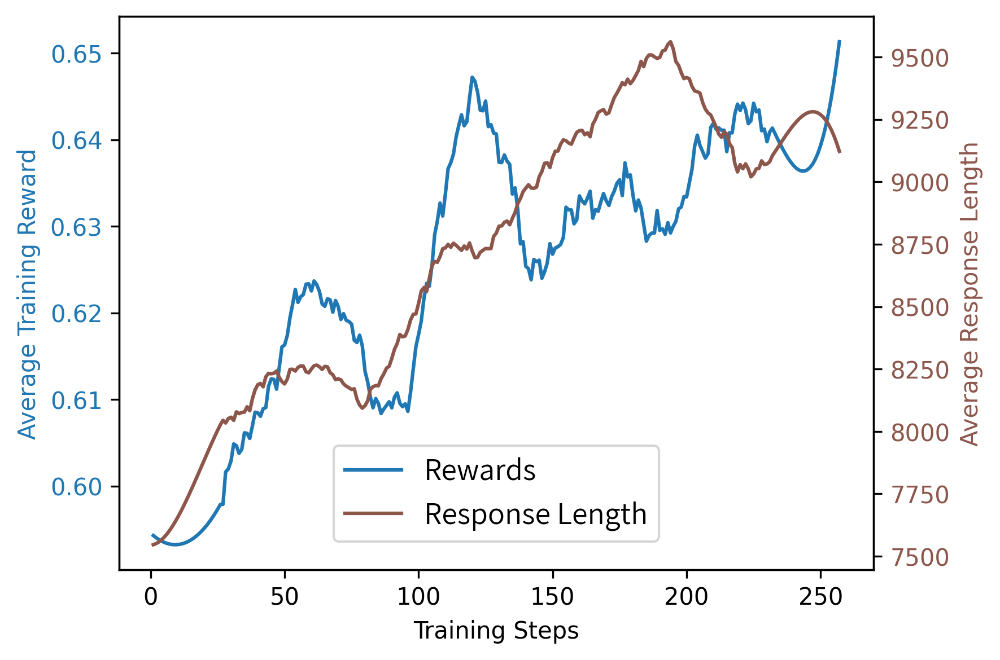

# Light-R1: Curriculum SFT, DPO and RL for Long COT from Scratch and Beyond


<div align="center">

[](https://arxiv.org/abs/2503.10460)
[](https://wandb.ai/seek4-nus/grpo-r1-share/reports/14B-GRPO--VmlldzoxMTczNzcyMw?accessToken=29hcarwh4qtt4hryx0zpjpkrssu8r7yo9dzm8ufeiejs8bvi3wu7ckq6oohvtjmf)

[](https://huggingface.co/collections/qihoo360/light-r1-67c675125e2443d7d5ed133d)
[](https://huggingface.co/datasets/qihoo360/Light-R1-SFTData)

</div>


### Mar. 12 update: [SOTA 7B](https://huggingface.co/qihoo360/Light-R1-7B-DS) and [SOTA RL 14B](https://huggingface.co/qihoo360/Light-R1-14B-DS) math models out! [Tech report](https://arxiv.org/abs/2503.10460) out!

|Model|Trained From|Release Date|AIME24|AIME25|GPQA|
| ---- | ---- | ---- | ---- | ---- |---- |
|DeepSeek-R1-Distill-Qwen-7B|Qwen2.5-Math-7B|25.1.20|55.5|39.2|49.1|
| [**Light-R1-7B-DS (ours)** 🤗](https://huggingface.co/qihoo360/Light-R1-7B-DS) |DeepSeek-R1-Distill-Qwen-7B|25.3.12|**59.1**|**44.3**|**49.4**|
|DeepSeek-R1-Distill-Qwen-14B|Qwen2.5-14B|25.1.20|69.7|50.2|59.1|
| [**Light-R1-14B-DS (ours)** 🤗](https://huggingface.co/qihoo360/Light-R1-14B-DS) |DeepSeek-R1-Distill-Qwen-14B|25.3.12|**74.0**|**60.2**|**61.7**|
| [**Light-R1-32B-DS (ours)** 🤗](https://huggingface.co/qihoo360/Light-R1-32B-DS) |DeepSeek-R1-Distill-Qwen-32B|25.3.12|**78.1**|**65.9**|**68.0**|
| [Light-R1-32B (ours) 🤗](https://huggingface.co/qihoo360/Light-R1-32B) |Qwen2.5-32B-Instruct|25.3.4|76.6|64.6|61.8|
| QwQ-32B |N/A|25.3.6|78.5|69.3|67.7|

We released SOTA math models across [7B🤗](https://huggingface.co/qihoo360/Light-R1-7B-DS) and [RL-14B🤗](https://huggingface.co/qihoo360/Light-R1-14B-DS) respectively, and also [32B-DS🤗](https://huggingface.co/qihoo360/Light-R1-32B-DS). [Technical report](https://arxiv.org/abs/2503.10460) is also out.

Notably, we made RL work on Light-R1-14B-DS!




### Mar.4: Light-R1-32B
|Model|Trained From|Release Date|AIME24|AIME25|
| ---- | ---- | ---- | ---- | ---- |
|DeepSeek-R1-Distill-Llama-70B|Llama-3.3-70B-Instruct|25.1.20|70.0|54.1|
|DeepSeek-R1-Distill-Qwen-32B|Qwen2.5-32B|25.1.20|72.6|54.9|
|LIMO (32B)|Qwen2.5-32B-Instruct|25.2.4|56.3|47.1|
|s1.1-32B|Qwen2.5-32B-Instruct|25.2.8|64.7|47.8|
|OpenThinker-32B|Qwen2.5-32B-Instruct|25.2.12|66.0|50.9|
| [**Light-R1-32B (ours)** 🤗](https://huggingface.co/qihoo360/Light-R1-32B) |Qwen2.5-32B-Instruct|25.3.4|**76.6**|**64.6**| 


While much work has been open-sourced trying to reproduce DeepSeek-R1 on models of 72B or less, **none** achieves similar performance on the hard math competition AIME24 as DeepSeek-R1-Distill-Qwen-32B's score 72.6.

We introduce Light-R1-32B, which achieves 76.6 on AIME24 training from Qwen2.5-32B-Instruct. Starting from models without long COT (*from scratch* in terms of R1) and training on decontaminated math data, we distilled DeepSeek-R1 with curriculum SFT & DPO to **surpass DeepSeek-R1-Distill-Qwen-32B** on AIME24 & 25, and improved further with model merging.

More importantly, 
besides the state-of-the-art from-scratch model Light-R1-32B, we also released on Day 1 all training datasets of our curriculum SFT & DPO and training code based on [360-LLaMA-Factory](https://github.com/Qihoo360/360-LLaMA-Factory).
Estimated training time on 12 x H800 machines takes no more than 6 hours --- around \$1000.

We believe Light-R1 represents a practical way of training strong long COT models from scratch (from models without long COT). While we are working to further improve our models with RL, curriculum SFT & DPO facilitates more control along the pipeline and is more cost-friendly.

With the rapid development of training and inference techniques, we hope to see more accessible long-COT models in the near future and Light-R1 provides a validated transparent way to train them in at least specialized domains.


## Release Details

- Light-R1-32B model on [🤗 huggingface](https://huggingface.co/qihoo360/Light-R1-32B)

- Curriculum [🤗SFT](https://huggingface.co/datasets/qihoo360/Light-R1-SFTData) & [🤗DPO](https://huggingface.co/datasets/qihoo360/Light-R1-DPOData) datasets (all our training data!)

- Training scripts based on [360-LLaMA-Factory](https://github.com/Qihoo360/360-LLaMA-Factory) in [train-scripts](./train-scripts/)

- Evaluation code based on [DeepScaleR](https://github.com/agentica-project/deepscaler) in [deepscaler-release](./deepscaler-release/)
    - along with evaluation logs of Light-R1-32B (e.g. [AIME24](https://huggingface.co/qihoo360/Light-R1-32B/blob/main/evaluation-results.aime24.json))
    - all our reported scores are averaged over 64 runs; public models' scores are taken from their evaluation results and if not present, averaged over 64 runs; we found that averaging over 16 runs sometimes leads to deviation over 2-3 points across different runs

- Technical report work in progress

## Inference Notes

Light-R1-32B does not always think as its thinking capabilities are trained only with math data.

We forced Light-R1 to think by hard-coding `<think>` in the chat template right before the model is supposed to generate output, as suggested by [DeepSeek](https://x.com/deepseek_ai/status/1890324295181824107).

[vLLM](https://github.com/vllm-project/vllm) or [SGLang](https://github.com/sgl-project/sglang) are suggested for inference.
Light-R1-32B inherits Qwen models' chat template with `<think>` and `</think>` added as special tokens and `<think>` hard-coded to force thinking.


## Post-Training through Curriculum SFT & DPO

|  | AIME24 pass@1 (64 average) | AIME25 | GPQA Diamond |
| --- | --- | --- | --- |
| Qwen2.5-32B-Instruct | 16.6 | 13.6 | 48.8 |
| DeepSeek-R1-Distill-Qwen-32B | 72.6 | 54.9 | 62.1 |
| Light-R1-SFT-stage1 | 69.0 | 57.4 | 64.3 |
| Light-R1-SFT-stage2 | 73.0 | 64.3 | 60.6 |
| Light-R1-DPO | 75.8 | 63.4 | 61.8 |
| Light-R1-32B | 76.6 | 64.6 | 61.8 | 

We adopted a curriculum learning approach with SFT and DPO.

### Math Data Sources
Training questions are collected from public math datasets including [OpenR1-Math-220k](open-r1/OpenR1-Math-220k), [OpenThoughts-114k](https://huggingface.co/datasets/open-thoughts/OpenThoughts-114k), [LIMO](https://huggingface.co/datasets/GAIR/LIMO), [OpenMathInstruct-2](https://huggingface.co/datasets/nvidia/OpenMathInstruct-2), [s1K-1.1](https://huggingface.co/datasets/simplescaling/s1K-1.1), [Omni-MATH](https://huggingface.co/datasets/KbsdJames/Omni-MATH), [hendrycks_math](https://hf-mirror.com/datasets/baber/hendrycks_math) and AIME (up to 2023).
We decontaminated the questions against common Reasoning benchmarks such as AIME24/25, MATH-500 and GPQA Diamond.

### Curriculum SFT & DPO
We collected responses from DeepSeek-R1 on these questions and filtered them based on verification and difficulty levels rated by sampling [DeepScaleR-1.5B-Preview](https://huggingface.co/agentica-org/DeepScaleR-1.5B-Preview), forming a 76k dataset for **SFT stage1**.

After SFT stage1, a more difficult set, mostly filtered from the 76k dataset, was constructed with 3k data for **SFT stage2**.
> This stage2 data could boost DeepSeek-R1-Distill-Qwen-32B from 72.6/54.9 to 0.779/0.675 on AIME 24/25.

Then we sampled Light-R1-SFT-stage2's responses after SFT stage2, filtered correct and incorrect ones for each question and construct DPO pairs based on verification results and DeepSeek-R1's responses.

**DPO**(or [NCA](https://github.com/thu-ml/Noise-Contrastive-Alignment)) is performed on top of SFT stage2 with sequence parallelism in [360-LLaMA-Factory](https://github.com/Qihoo360/360-LLaMA-Factory).

The above training steps are fairly fast and are estimated to finish in less than 6 hours on 12 x H800 machines, hence the estimate of \$1000.

### Model Merging
Finally, we merged models of SFT-stage2, DPO and another DPO version with AIME24 score 74.7.
The two DPO versions differ in that one of the data has special tokens skipped in rejected responses. Interestingly, the resulting version also exhibits improvement.

We observed stepwise improvement in our approach and intermediate evaluation results of each stage are listed in the table above.
On the GPQA evaluation of scientific questions we didn't train on at all, math-specialized training has led to some degree of forgetting. However, Light-R1-32B still demonstrates strong generalization ability. 


## Data Decontamination

We carefully evaluated data contamination of several open-sourced datasets.
While certain contamination may be [inevitable during pre-training](https://x.com/DimitrisPapail/status/1888325914603516214),
it is unacceptable for post-training to compare on benchmarks.
MATH-500 is somewhat compromised with tens of questions that are identical or only numbers changed. AIME 24 and 25 stay intact but we have to pay special attention when we incorporate AIME data up to 2023.

Light-R1 did thorough decontamination with exact matching (excluding digits) and N-gram (N=32) matching.


## License & Acknowledgements

All released materials of this project follow the open-source license Apache 2.0.

Our training experiments are powered by [360-LLaMA-Factory](https://github.com/Qihoo360/360-LLaMA-Factory).
Our evaluation scripts are based on [DeepScaleR](https://github.com/agentica-project/deepscaler) and therefore [verl](https://github.com/volcengine/veRL).

Light-R1-32B is trained from [Qwen2.5-32B-Instruct](https://huggingface.co/Qwen/Qwen2.5-32B-Instruct).
Training data are collected from various public sources.


## Citation

```bibtex
@article{wen2025light,
  title={Light-R1: Curriculum SFT, DPO and RL for Long COT from Scratch and Beyond},
  author={Wen, Liang and Cai, Yunke and Xiao, Fenrui and He, Xin and An, Qi and Duan, Zhenyu and Du, Yimin and Liu, Junchen and Tang, Lifu and Lv, Xiaowei and Zou, Haosheng and Deng, Yongchao and Jia, Shousheng and Zhang, Xiangzheng},
  journal={arXiv preprint arXiv:2503.10460},
  year={2025}
}
```
